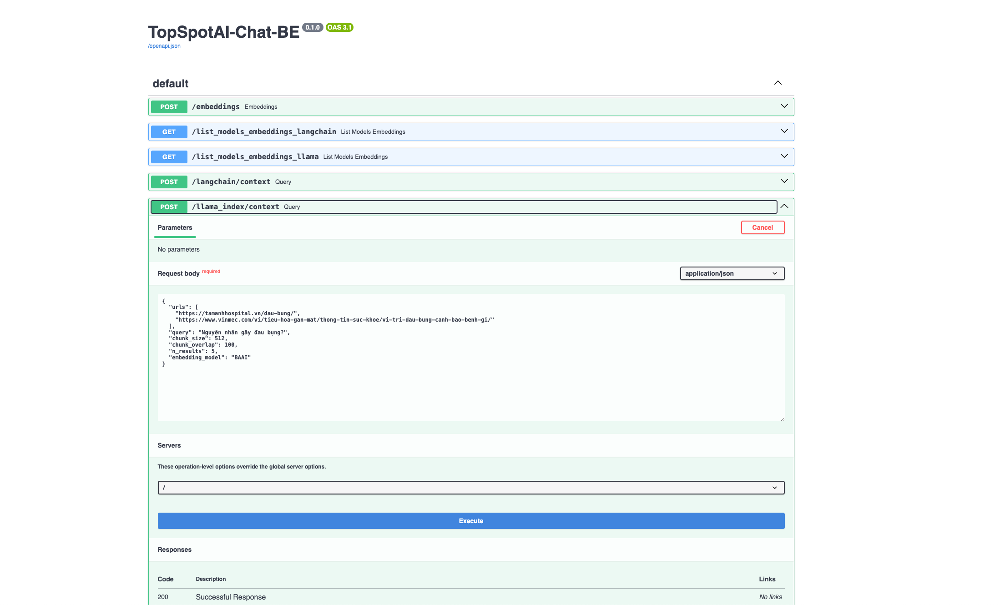
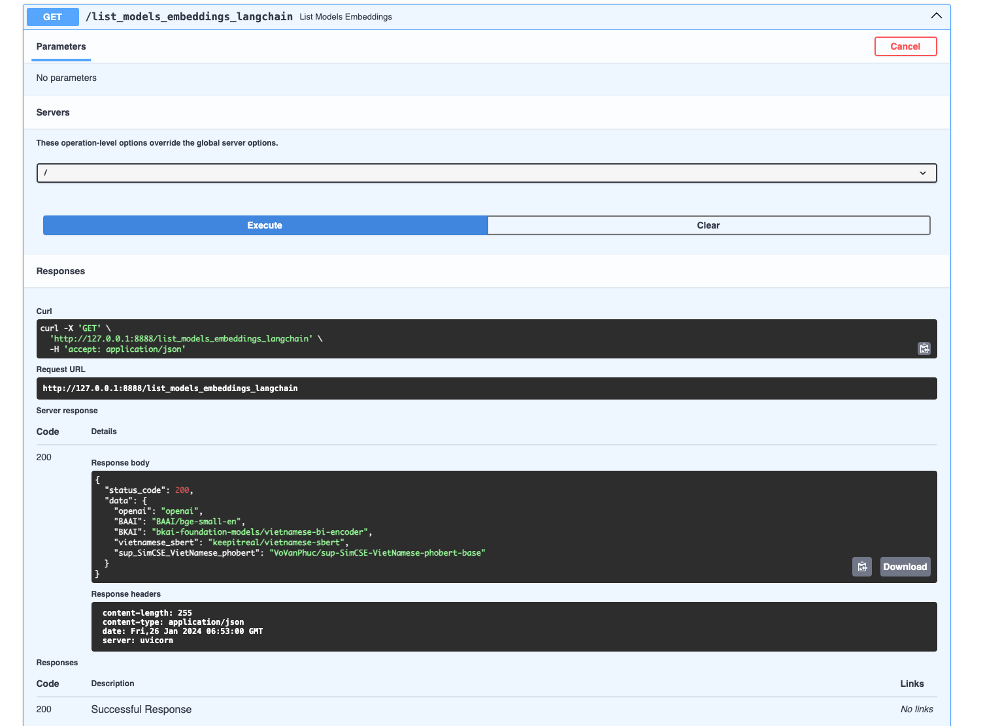
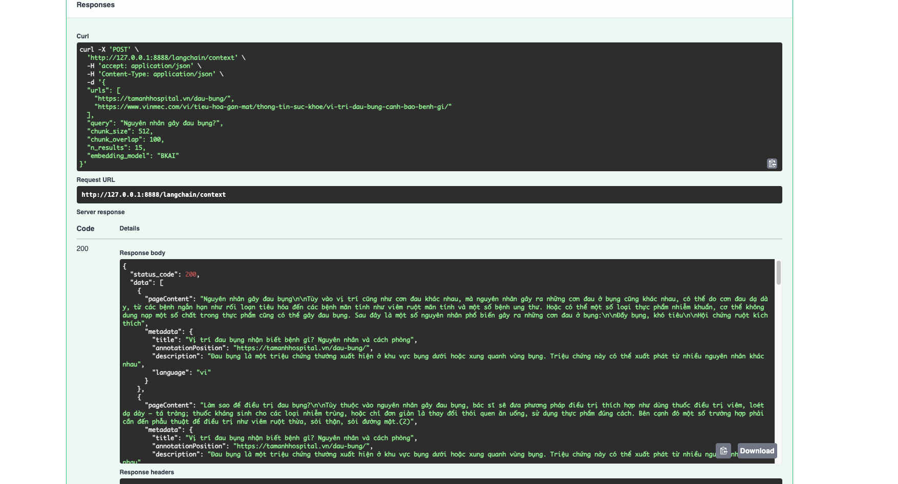
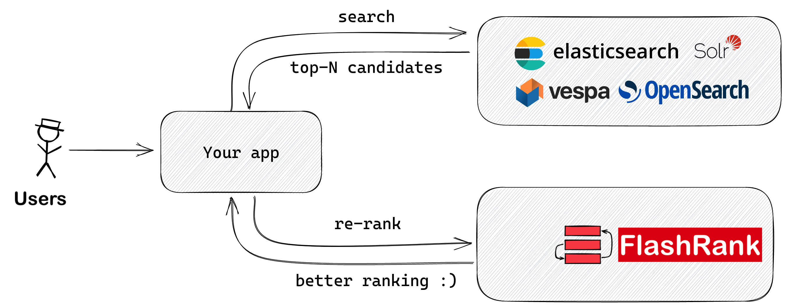
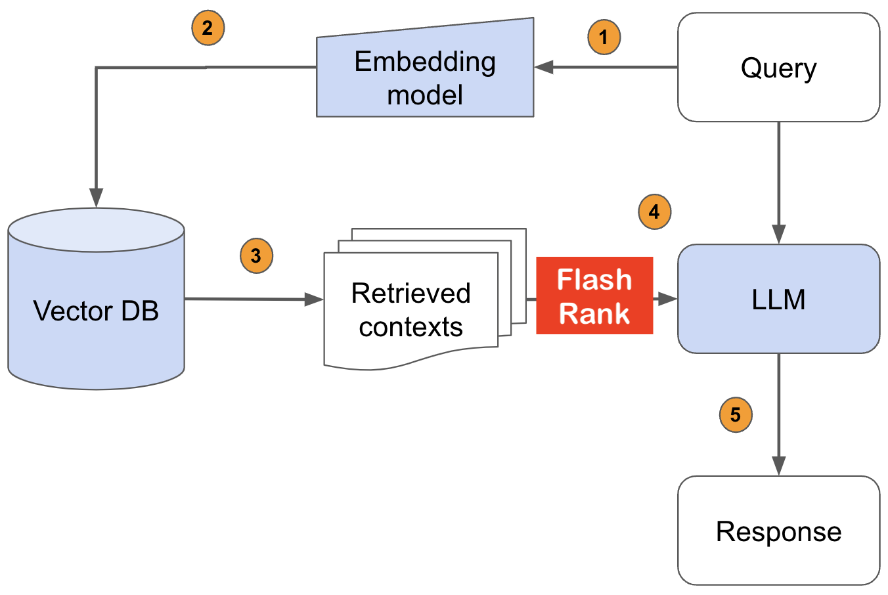
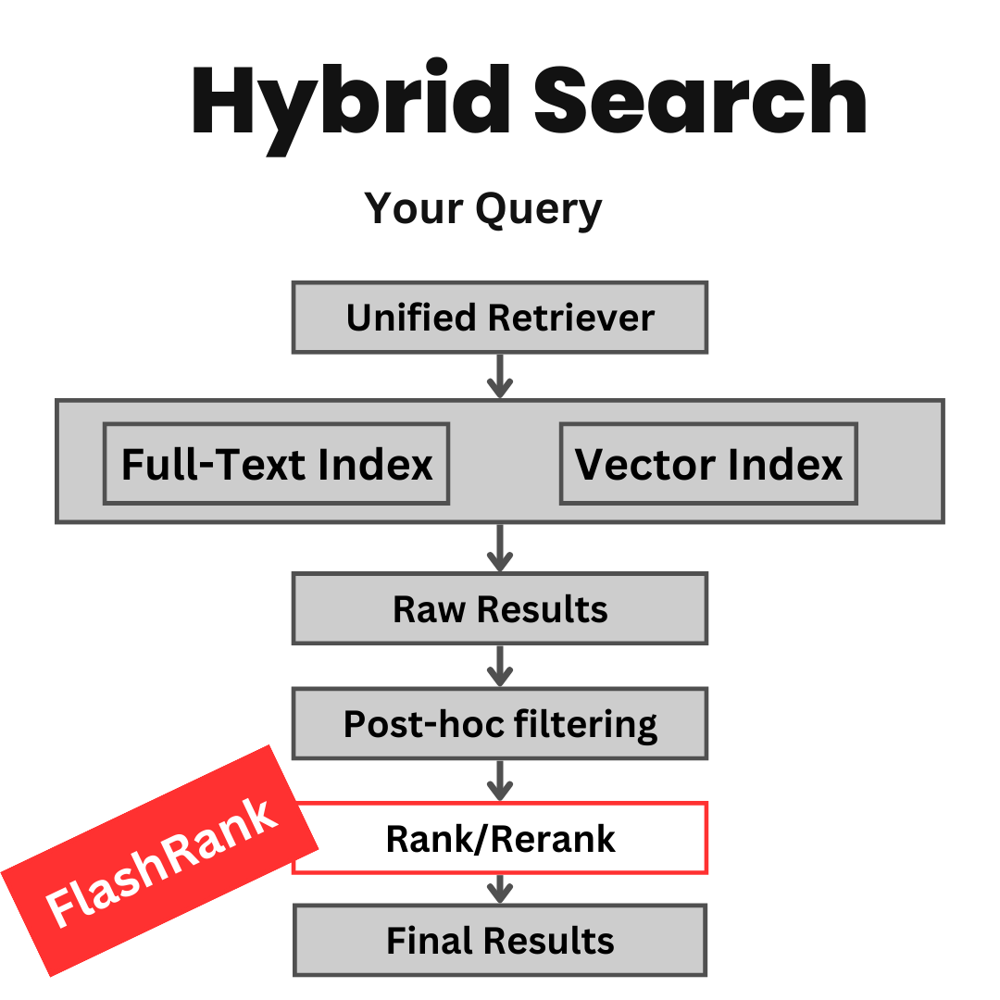

# TopSpotAI Chat Backend

## Deployment

```
docker-compose up -d --build
```

### Opening SwaggerUI
In your favorite browser, go to the following link - 
```
http://127.0.0.1:8888/docs
``` 
**Docs API**
  <center></center>

<br/>
  <center></center>

<br/>
  <center></center>

<br/>

## You can use it with any search & retrieval pipeline(In progress):

1. **Lexical Search (RegularDBs that supports full-text search or Inverted Index)**
  <center></center>

<br/>

2. **Semantic Search / RAG usecases (VectorDBs)**
  <center></center>
<br/>

3. **Hybrid Search**
  <center></center>

<br/>

